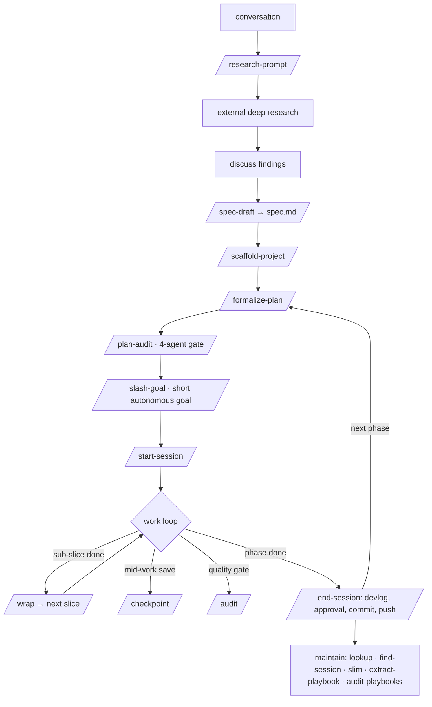

# Agent Workflow Bundle — Agent Instructions

Canonical cross-agent instructions for working **on this repository**. [CLAUDE.md](CLAUDE.md) is a Claude Code compatibility pointer to this file — keep them in sync.

> This file is for an agent editing the bundle itself. It is **not** installed into other projects — the installer copies only `skills/` and `playbooks/`. The `example-skeleton/AGENTS.md` is a separate, illustrative sample of what `/scaffold-project` produces; don't confuse the two.

## What this project is

The Agent Workflow Bundle is a **portable collection of skills, playbooks, an installer, and workflow docs** that gives Codex, Claude Code, and other skill-aware agents the same session-management discipline, project-bootstrap workflow, and cross-project architectural patterns. You hand the folder to an agent, run the installer, and the skills become invocable in every project on that machine.

Wear two hats here:

1. **The bundle defines a workflow** that gets *used* in other projects (research → spec → scaffold → develop → maintain). To change how that workflow behaves anywhere, you edit a `SKILL.md` here.
2. **Working *on* the bundle** means authoring/editing skills and playbooks, keeping the three top-level docs in sync, and re-deploying changed skills to the install roots. There is no app to build and no test suite — the "product" is the prose in the skills.

## Repository structure

| Path | What it is |
|------|------------|
| `skills/<name>/SKILL.md` | One skill each. The source of truth. 17 skills today. |
| `skills/scaffold-project/templates/` | Frontmatter `SCHEMA.md` + 5 templates (devlog, phase, knowledge, lessons, state) used during scaffolding |
| `playbooks/` | Cross-project architectural patterns; `playbooks/INDEX.md` is the master index |
| `example-skeleton/` | Minimal illustrative example of what `/scaffold-project` produces (sample, not installed) |
| `scripts/install.{ps1,sh}` + OS wrappers | Installers for `~/.agents`, `~/.claude`, `~/.codex` |
| `README.md` | Human-facing overview + skill catalog |
| `WORKFLOW.md` | Full workflow narrative (the authority for the walkthrough below) |
| `INSTALL.md` | Agent-facing install + update instructions |
| `AGENTS.md` / `CLAUDE.md` | These files — instructions for working on the bundle |

## The workflow this bundle implements

Three stages plus ongoing maintenance. Full narrative in [WORKFLOW.md](WORKFLOW.md); this is the walkthrough.

**Stage 1 — Converse & research.** Talk through what you're building (30–90 min). Run `/research-prompt` to emit question-only investigation docs; run them through an external deep-research tool; save results under `docs/research_results/`; discuss. For multi-week projects, `/spec-draft` distills a `docs/design/spec.md` that becomes the authority `/audit` and `/plan-audit` measure against.

**Stage 2 — Scaffold.** `/scaffold-project` builds the full project skeleton: `AGENTS.md` + `CLAUDE.md`, `docs/SCHEMA.md` (frontmatter contract), `docs/implementation-plan.md`, phase docs, knowledge base, `state.md`, `lessons.md`, code skeleton, git init, and (for non-web apps) an MCP co-development surface.

**Stage 3 — Active development**, repeated per phase:
- `/formalize-plan` turns a plan into `docs/phases/phase-N-*.md` with pass criteria and an **Autonomy & human-in-the-loop** section.
- `/plan-audit` (optional, for substantial phases) runs four parallel agents — spec-alignment, **acceptance-bar/proof-altitude**, toolchain-feasibility, decomposition — and fixes the plan.
- `/slash-goal` (optional) emits a short `"slash goal"` completion-condition that points at the phase doc and drives it autonomously.
- `/start-session` orients from the last commit + devlog `approval` frontmatter, then works.
- During work: `/wrap` closes each sub-slice and rolls on; `/checkpoint` is a mid-work save; `/audit` is a quality gate.
- `/end-session` is the full phase close-out (devlog complete, approval, state, lessons, schema audit, commit/push).

**Maintenance (ongoing):** `/lookup` and `/find-session` to recall; `/slim-agent-md` when an instruction file passes 25K chars; `/extract-playbook` for cross-project patterns; `/audit-playbooks` quarterly.

### Visual graph

```
 STAGE 1 · CONVERSE & RESEARCH
   conversation
        │
        ▼
   /research-prompt ──▶ (external deep research) ──▶ discuss findings
        │
        ▼
   /spec-draft ······▶ docs/design/spec.md        (multi-week projects only)
        │
        ▼
 STAGE 2 · SCAFFOLD
   /scaffold-project ──▶ AGENTS.md + CLAUDE.md, docs/, phases, skills, git
        │
        ▼
 STAGE 3 · ACTIVE DEVELOPMENT   ◀─────────────────────────┐  (repeat per phase)
   /formalize-plan ──▶ /plan-audit ──▶ /slash-goal         │
   (plan → phase doc)  (4-agent gate)  (short autonomous   │
        │                               goal, optional)    │
        ▼                                                  │
   /start-session                                          │
        │                                                  │
        ▼                                                  │
   ┌─────────── work loop ───────────┐                     │
   │  implement                      │                     │
   │  /wrap       close sub-slice,   │                     │
   │              roll to next  ─────┼──▶ (next sub-slice) │
   │  /checkpoint mid-work save      │                     │
   │  /audit      quality gate       │                     │
   └─────────────────────────────────┘                     │
        │                                                  │
        ▼                                                  │
   /end-session ──▶ devlog complete · approval · state ·   │
        │            lessons · commit · push ──────────────┘
        ▼
 MAINTENANCE (ongoing)
   /lookup · /find-session · /slim-agent-md · /extract-playbook · /audit-playbooks
```

The three closers, lightest to heaviest: **`/checkpoint`** (mid-work save, not a boundary) → **`/wrap`** (sub-slice done, roll on) → **`/end-session`** (full phase close-out).



## Skills catalog

**Session management:** `/start-session`, `/checkpoint`, `/wrap`, `/plan-audit`, `/audit`, `/end-session`, `/find-session`, `/formalize-plan`, `/slash-goal`.
**Planning / bootstrap / knowledge:** `/research-prompt`, `/spec-draft`, `/scaffold-project`, `/slim-agent-md` (+ `/slim-claude-md` alias), `/lookup`, `/extract-playbook`, `/audit-playbooks`.

See [README.md](README.md) for one-line purposes. The skill's own `SKILL.md` is the detail.

## Working ON the bundle

### Authoring & editing skills

A skill is a folder `skills/<name>/SKILL.md` with YAML frontmatter:

```yaml
---
name: <kebab-case, matches folder>
description: <one line — used for recall/match>
allowed-tools: Read, Write, Edit, Glob, Grep, Bash(git:*)   # least privilege
user-invocable: true
---
```

Body is prose instructions in the imperative. Match the voice of neighboring skills (declarative, tight, em dashes OK). Keep a skill lean; if it bloats, the bundle's own `/slim-*` doctrine applies (target 20–25K, hard ceiling 40K).

### Deploy discipline (important)

`skills/` here is the **source of truth**, but editing a skill does nothing until it's copied to the install roots an agent actually reads:

- Local roots: `~/.agents/skills/`, `~/.claude/skills/`, `~/.codex/skills/`
- Remote machines in use, e.g. sbot2 at `\\sbot-2\C\Users\bot\.claude\skills\` (SMB) or `scp` to `sbot2:C:/Users/bot/.claude/skills/`

The installer (`scripts/install.ps1 -Target all`) is **all-or-nothing on conflicts** — it refuses the whole run if any skill already exists. For a single changed/new skill, copy that one folder directly (`Copy-Item`/`scp`) rather than `-Overwrite`-ing the world. After deploying, the target agent must restart to reload skills.

### Keep the docs in sync

When you add, rename, or materially change a skill, update **all three** in the same commit: `README.md` (catalog row), `WORKFLOW.md` (narrative), and the relevant `INSTALL.md` notes. A new skill also needs registering in the skill catalog above.

### Commit & git

- Conventional commits: `feat(<skill>): …`, `fix(<skill>): …`, `docs: …`.
- Co-author footer only when convention asks for it.
- `main` has an upstream (`origin` on GitHub). Commit/push only when asked; never `--force`, never `git add -A` (stage explicit paths).

## Conventions & doctrine

These are settled decisions — honor them when editing skills:

- **No interactive prompts in skills.** Auto-synthesize from session evidence; never pause to ask for input the model could derive. (Exception: a genuinely unsettled, underivable decision.)
- **`/end-session` always commits**, staging only files the model touched this session; it ignores unrelated dirty tree state.
- **Goals are thin pointers.** `/slash-goal` produces a *short* completion-condition that references the phase doc; the plan carries the detail (sub-slices, pass criteria, gate tiers, pre-authorizations). Don't re-encode the plan into the goal.
- **`$`-prefixed workflow commands in goal text** (`$start-session`, `$wrap`, `$audit`, `$end-session`) — Codex-style, never a slash. MCP paths and shell commands keep their real syntax.
- **Anti-stall:** a goal must never freeze on a permission prompt — auto-approved command forms only; on denial, switch to an allowed equivalent and continue.
- **Human-in-the-loop is tiered, not blanket-stop:** self-serve (aesthetics, approval cadence → log + continue), conditional-proceed (pre-authorized with a testable rule), hard-stop (irreversible/unsettled). Decided at plan time.
- **Proof altitude:** every user-facing feature phase needs a pass criterion that is *false unless the experience exists* — visible/behavioral/executing, with vision_eval asserting screenshot content. Readback/log/"artifact exists" can be cleared by a mock. Citing a spec is not verifying against it. This is what `/plan-audit`'s acceptance-bar agent enforces.

## What to avoid

- **Editing an installed copy instead of the bundle source.** Changes belong in `skills/` here, then deploy outward. Editing in an install root is a treadmill that the next update overwrites.
- **`-Overwrite`-ing all skills** to ship one change — it blows away unrelated installed skills wholesale. Copy the single folder.
- **Letting README/WORKFLOW/INSTALL drift** from the skills. A skill change that isn't reflected in the docs is half-done.
- **Adding ceremony a user didn't ask for** (turn caps, verbose templates, interrogation). The bundle favors lean skills that do exactly what's needed.
